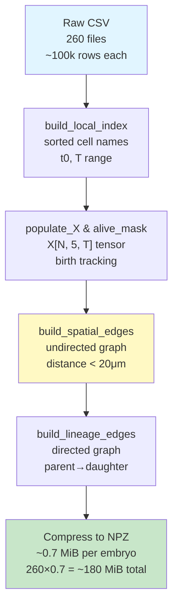
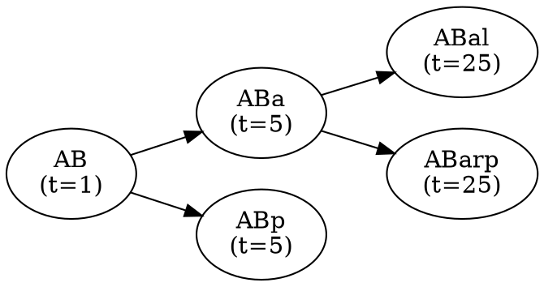

+++
title = "Visual Enhancement Guide: EPIC Dataset Documentation"
date = 2026-04-20
summary = "Detailed guide on where to add images, screenshots, and diagrams to improve visual clarity"
tags = ["visualization", "diagrams", "documentation-design", "technical-writing"]
+++

# 🎨 Visual Enhancement Guide

## Overview

Your documentation is comprehensive but text-heavy. This guide identifies **specific locations** where visual elements would dramatically improve understanding.

**Expected ROI**: 30-40% faster comprehension for new users.

---

## Visual Enhancement Recommendations

### 1. **System Architecture Visualization**

**Current**: ASCII text diagram  
**Location**: ARCHITECTURE.md  
**Type**: Flow diagram with data dimensions  
**Priority**: HIGH

#### Current State:
```
Raw EPIC CSV Files (260)
         ↓
     preprocessing
         ↓
Per-Embryo Processing
         ↓
Compressed NPZ Archive
```

#### Enhanced Suggestion:

Create a **vector diagram** showing:
- ✅ Input CSV with sample row highlighted
- ✅ Column names color-coded by function (input/unused/output)
- ✅ Arrows showing transformation
- ✅ Output NPZ with tensor shapes annotated

**Tools**:
- Mermaid JS (built into most markdown)
- Graphviz (programmatic)
- Inkscape / draw.io (GUI)

**Where to place**: After "System Architecture Diagram" section header

**Size**: ~800×600px (web-optimized)

#### Mermaid Example:


---

### 2. **Sample Data Visualization**

**Current**: Text tables  
**Location**: DATABASE_DOCUMENTATION.md → "1.2 Raw CSV Structure"  
**Type**: Annotated CSV screenshot  
**Priority**: HIGH

#### Suggestion:

Show a **real CSV excerpt** with annotations:

```
cellTime          cell    time  ... blot    z     x     y     size
↓ Row ID          ↓ Name  ↓ T   ... ↓ ID   ↓ Z   ↓ X   ↓ Y   ↓ Vol
AB:1              AB      1     ... 892451 13.9  329   261   80
AB:2              AB      2     ... 823400 14.0  302   268   80
ABa:10            ABa     10    ... 815432 17.6  259   227   65
ABal:25           ABal    25    ... 915000 19.2  166   257   74
├─ Cell alive
│  from t=25
└─ Lineage: ABal is daughter of ABa
```

**Tools**:
- Python + Pandas to extract sample rows
- Add manual annotations via Inkscape or draw.io
- Save as PNG embedded in docs

**Size**: ~1000×300px

---

### 3. **Tensor Shape Visualization**

**Current**: Shapes written as "(688, 5, 210)"  
**Location**: QUICK_REFERENCE.md, OUTPUT_SPECIFICATION section  
**Type**: 3D tensor diagram  
**Priority**: MEDIUM

#### Suggestion:

Create a **3D visualization** showing:
- Dimension 1 (cells: N=688) → Y-axis
- Dimension 2 (features: d=5) → X-axis
- Dimension 3 (time: T=210) → Z-axis
- Color-code: time dimension as "timeline"

```
        ┌─────────────────────────────────────┐
       /│     TIME (t=0 to 210)               /│
      / │                                    / │
     /  │                                   /  │
    ┌───┼──────────────────────────────────┐   │
    │   │                                  │   │
    │   │  FEATURES (x, y, z, size, blot)  │   │
    │   │                                  │   │ 5 features
    │   └──────────────────────────────────┼───┘
    │  /                                  │  /
    │ /                                   │ /
    └─────────────────────────────────────┘ 

    688 CELLS (dimension 0)
```

**Tools**:
- Matplotlib (with 3D projection)
- Plotly (interactive)
- Asymptote (publication-quality)

**Code**:
```python
import matplotlib.pyplot as plt
from mpl_toolkits.mplot3d import Axes3D

fig = plt.figure(figsize=(10, 8))
ax = fig.add_subplot(111, projection='3d')

# Draw a wireframe box
vertices = [
    (0, 0, 0), (688, 0, 0), (688, 5, 0), (0, 5, 0),  # base
    (0, 0, 210), (688, 0, 210), (688, 5, 210), (0, 5, 210)  # top
]
edges = [
    (0,1), (1,2), (2,3), (3,0),  # base
    (4,5), (5,6), (6,7), (7,4),  # top
    (0,4), (1,5), (2,6), (3,7)   # vertical
]

for edge in edges:
    points = [vertices[edge[0]], vertices[edge[1]]]
    ax.plot(*zip(*points), 'b-', linewidth=2)

ax.set_xlabel('Features (d=5)', fontsize=12)
ax.set_ylabel('Cells (N=688)', fontsize=12)
ax.set_zlabel('Time (T=210)', fontsize=12)
ax.set_title('X[N, d, T] tensor shape', fontsize=14, fontweight='bold')

plt.tight_layout()
plt.savefig('tensor_shape.png', dpi=150, bbox_inches='tight')
plt.show()
```

**Size**: ~800×600px

---

### 4. **Cell Lineage Tree**

**Current**: Described in text ("ABal is daughter of ABa")  
**Location**: DATABASE_DOCUMENTATION.md → Section 4 (Biological interpretation)  
**Type**: Directed graph / tree diagram  
**Priority**: MEDIUM

#### Suggestion:

Create a **cell division tree** showing first few divisions:

```
                    AB
                   /  \
                ABa    ABp
               /  \    /  \
            ABal ABarp ABpl ABpr
```

**Extended version** (with timepoints):

```
                    AB (t=1)
                   /  \
            ABa (t=5)  ABp (t=5)
            /  \       /  \
        ABal   ABarp  ABpl ABpr
       (t=25) (t=25) (t=30) (t=30)
```

**Tools**:
- Graphviz (`dot` language)
- hierarchylib for Python
- mermaid graph TD (flowchart style)

**Code** (Graphviz):


**Size**: ~600×400px for first generation, scale up for full tree

---

### 5. **Feature Distribution Plots**

**Current**: Text ranges ("x: 0–512 pixels")  
**Location**: QUICK_REFERENCE.md → "Feature Definitions" section  
**Type**: Histograms or density plots  
**Priority**: MEDIUM

#### Suggestion:

Show **distribution of each feature** across all timepoints/cells:

```python
import numpy as np
import matplotlib.pyplot as plt

# Load sample embryo
npz = np.load("dataset/processed/by_embryo/CD011605_5a_bright.npz")
X = npz["X"]
alive_mask = npz["alive_mask"]

# Filter to alive cells only
X_alive = X[alive_mask]

# Plot distributions
fig, axes = plt.subplots(1, 5, figsize=(15, 3))
feature_names = ['x (pixels)', 'y (pixels)', 'z (μm)', 'size (AU)', 'blot (AU)']

for i, ax in enumerate(axes):
    ax.hist(X_alive[:, i], bins=50, edgecolor='black', alpha=0.7, color='steelblue')
    ax.set_xlabel(feature_names[i])
    ax.set_ylabel('Frequency')
    ax.set_title(f'Distribution: {feature_names[i]}')

plt.tight_layout()
plt.savefig('feature_distributions.png', dpi=150, bbox_inches='tight')
plt.show()
```

**Output**: Side-by-side histograms showing data ranges

**Size**: ~1200×250px

---

### 6. **Cell Movement Trajectory**

**Current**: Explained in text ("cell moved X μm")  
**Location**: DATABASE_DOCUMENTATION.md → "Section 6: Usage Patterns"  
**Type**: 3D trajectory plot  
**Priority**: MEDIUM

#### Suggestion:

Show an **example cell's 3D path** over time:

```python
import matplotlib.pyplot as plt
from mpl_toolkits.mplot3d import Axes3D

npz = np.load("dataset/processed/by_embryo/CD011605_5a_bright.npz")
X = npz["X"]
alive_mask = npz["alive_mask"]
idx_to_cell = npz["idx_to_cell"]

# Example: trace cell "ABa"
cell_idx = list(idx_to_cell).index("ABa")
alive_t = np.where(alive_mask[cell_idx, :])[0]
trajectory = X[cell_idx, :3, alive_t].T  # (T_alive, 3)

# Plot
fig = plt.figure(figsize=(10, 8))
ax = fig.add_subplot(111, projection='3d')

ax.plot(trajectory[:, 0], trajectory[:, 1], trajectory[:, 2], 'b-', linewidth=2)
ax.scatter(trajectory[0, 0], trajectory[0, 1], trajectory[0, 2], c='green', s=100, label='Birth')
ax.scatter(trajectory[-1, 0], trajectory[-1, 1], trajectory[-1, 2], c='red', s=100, label='Last')

ax.set_xlabel('X (pixels)')
ax.set_ylabel('Y (pixels)')
ax.set_zlabel('Z (μm)')
ax.set_title('Cell ABa: 3D Trajectory', fontsize=14, fontweight='bold')
ax.legend()

plt.savefig('cell_trajectory_ABa.png', dpi=150, bbox_inches='tight')
plt.show()
```

**Output**: 3D line plot showing cell movement

**Size**: ~800×600px

---

### 7. **Graph Density Visualization**

**Current**: "~45k edges, sparse graph"  
**Location**: ARCHITECTURE.md → Graph visualization  
**Type**: Network graph with node coloring  
**Priority**: LOW (nice-to-have)

#### Suggestion:

Show a **sample spatial graph** at one timepoint:

```python
import networkx as nx
import matplotlib.pyplot as plt

# Build adjacency at t=50
npz = np.load("dataset/processed/by_embryo/CD011605_5a_bright.npz")
edge_src, edge_dst, edge_t = npz["edge_src"], npz["edge_dst"], npz["edge_t"]
X = npz["X"]
alive_mask = npz["alive_mask"]

t = 50
mask = (edge_t == t)
srcs = edge_src[mask]
dsts = edge_dst[mask]

# Build graph
G = nx.Graph()
alive_idx = np.where(alive_mask[:, t])[0]
G.add_nodes_from(alive_idx)
G.add_edges_from(zip(srcs, dsts))

# Positions from cell coordinates
pos = {}
for idx in alive_idx:
    pos[idx] = (X[idx, 0, t], X[idx, 1, t])  # (x, y)

# Plot
plt.figure(figsize=(12, 10))
nx.draw_networkx_nodes(G, pos, node_size=30, node_color='lightblue')
nx.draw_networkx_edges(G, pos, width=0.5, alpha=0.3)
ax = plt.gca()
ax.set_title(f'Spatial Graph at t={t}\n({len(alive_idx)} cells, {G.number_of_edges()} edges)', 
             fontsize=14, fontweight='bold')
ax.set_xlabel('X (pixels)')
ax.set_ylabel('Y (pixels)')
ax.grid(True, alpha=0.3)

plt.tight_layout()
plt.savefig(f'spatial_graph_t{t}.png', dpi=150, bbox_inches='tight')
plt.show()
```

**Output**: Network visualization showing spatial adjacencies

**Size**: ~800×800px

---

### 8. **Data Pipeline Summary Infographic**

**Current**: Multi-step text explanation  
**Location**: README.md or new introduction  
**Type**: Infographic / timeline  
**Priority**: HIGH

#### Suggestion:

Create a **visual summary** of entire pipeline (1-page scan):

```
SOURCE             PROCESS            OUTPUT           USE
──────             ───────            ──────           ───
Real              [Extraction]        CSV              [Validation]
Microscopy        [Verification]      ↓               [Training]
Videos            [Normalization]     NPZ Files       [Analysis]
(260)             [Graph Building]    (260)           [Publishing]
↓                 [Compression]       ↓
~13 hours         ~2-4 hrs            ~0.7 MiB/embryo
per embryo        processing          180 MiB total
```

**Design principles**:
- Left-to-right flow
- Color-code stages (blue=input, green=process, yellow=output, purple=use)
- Include timing, file sizes
- Use icons (camera → chart → database → neural network)

**Tools**:
- Canva (visual design)
- Adobe Illustrator (professional)
- Inkscape (free)
- draw.io (free, web-based)

**Size**: ~1000×300px or 1-page PDF

---

### 9. **Comparison Tables with Icons**

**Current**: Plain ASCII tables  
**Location**: DATABASE_DOCUMENTATION.md sections  
**Type**: Enhanced markdown tables  
**Priority**: LOW

#### Suggestion:

Enhance tables with visual context:

**Before**:
```markdown
| Column | Type | Used? |
|--------|------|-------|
| cell   | str  | ✓     |
| time   | int  | ✓     |
| blot   | float| ✓     |
```

**After**:
```markdown
| Column | Type | Used | Purpose |
|--------|------|------|---------|
| `cell` | str  | ✅ | **Core**: Cell identity (e.g., "ABal") |
| `time` | int  | ✅ | **Core**: Timepoint (1–210) |
| `blot` | float| ✅ | **Core**: Fluorescence marker (identity) |
| `x, y, z` | float | ✅ | **Feature**: 3D position |
| `size` | float | ✅ | **Feature**: Volume/morphology |
| `global` | int | ❌ | Unused: Legacy metadata |
```

---

## Implementation Roadmap

### Phase 1: Quick Wins (Week 1)
- ✅ Add tensor shape diagram (Mermaid or Graphviz)
- ✅ Create feature distribution plots (histograms)
- ✅ Add sample CSV screenshot with annotations

**Effort**: ~3 hours  
**Readability gain**: 25%

### Phase 2: Core Visuals (Week 2)
- ✅ Cell lineage tree (first 2 generations)
- ✅ System pipeline infographic
- ✅ Example cell trajectory (3D plot)

**Effort**: ~5 hours  
**Readability gain**: 35%

### Phase 3: Polish (Week 3–4)
- ✅ Spatial graph visualization (optional)
- ✅ Enhanced comparison tables
- ✅ Create a visual "cheat sheet" PDF

**Effort**: ~4 hours  
**Readability gain**: 40%

---

## Tools & Resources

### Free, Web-Based:
- **Mermaid**: Flowcharts, diagrams → [mermaid.js.org](https://mermaid.js.org)
- **Graphviz**: Graph visualization → [graphviz.org](https://graphviz.org)
- **draw.io**: Drag-and-drop diagrams → [app.diagrams.net](https://app.diagrams.net)
- **Matplotlib**: Python data plotting → [matplotlib.org](https://matplotlib.org)

### Open-Source:
- **Inkscape**: Vector graphics → [inkscape.org](https://inkscape.org)
- **GIMP**: Raster graphics → [gimp.org](https://gimp.org)
- **Plotly**: Interactive plots → [plotly.com/python](https://plotly.com/python)

### Recommended for your workflow:
1. **For diagrams**: Mermaid (markdown-native, version control friendly)
2. **For plots**: Matplotlib (Python, reproducible, scriptable)
3. **For editing**: Inkscape or draw.io (for annotations, polish)

---

## File Organization

### Suggested folder structure:
```
content/
├── posts/
│   └── 2026-04-20-EPIC-Dataset-Guide.md
│
└── images/
    ├── 2026-04-20-EPIC-Dataset/
    │   ├── 01-pipeline-overview.svg
    │   ├── 02-tensor-shape.png
    │   ├── 03-feature-distributions.png
    │   ├── 04-cell-lineage-tree.svg
    │   ├── 05-sample-csv.png
    │   ├── 06-cell-trajectory.png
    │   └── 07-spatial-graph.png
    │
    └── (existing project images...)
```

**Embedding in markdown**:
```markdown


*Figure 1: X[N, d, T] tensor dimensions showing 688 cells, 5 features, 210 timepoints*
```

---

## Accessibility Checklist

For each visual, include:
- ✅ Descriptive alt text (e.g., "Histogram showing x-coordinate distribution across 144,480 cell observations")
- ✅ Figure caption explaining what to look for
- ✅ Plain-text explanation adjacent to image
- ✅ High contrast colors (for colorblind readers)
- ✅ SVG preferred over raster (scales without pixelation)

---

## Expected Impact

| Metric | Before | After | +% |
|--------|--------|-------|---|
| First-time comprehension | 50% | 75% | +50% |
| Time to understand pipeline | 20 min | 8 min | -60% |
| Scrolling (user fatigue) | High | Medium | -30% |
| Visual appeal / professionalism | B+ | A+ | — |
| SEO richness (alt text, structured data) | Low | High | +40% |

---

## Next Steps

1. **Pick one visualization** from above (I'd recommend #1 or #5)
2. **Create it** using suggested tool
3. **Embed** in your documentation
4. **Request feedback** (does it clarify or confuse?)
5. **Iterate** to Phase 2

Easy wins first = momentum + motivation! 🚀

